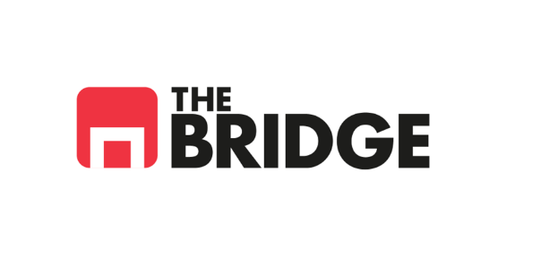

# Predicción de Costos de Seguro Médico con Machine Learning

## Estructura del Proyecto

- `ML Project- Deivid Jimenez Final.ipynb`: Notebook principal con todo el análisis, visualización y modelos de predicción.
- `./data/insurance.csv`: Dataset utilizado para el entrenamiento y pruebas. Dataset público extraído de Kaggle [text](https://www.kaggle.com/datasets/mirichoi0218/insurance)
- `image.png`: Imagen ilustrativa del modelo o flujo de trabajo.

##  Tecnologías utilizadas

- Python
- Pandas, NumPy
- Matplotlib, Seaborn
- Scikit-learn (Linear Regression, Random Forest, Gradient Boosting)
- Pipelines de preprocesamiento

## Modelos utilizados

- **Regresión Lineal**
- **Random Forest Regressor**
- **Gradient Boosting Regressor**

## Evaluación

Los modelos son evaluados usando:

- Mean Absolute Error (MAE)
- Mean Squared Error (MSE)
- R² Score

## Cómo ejecutar

1. Clona este repositorio o descarga los archivos.
2. Asegúrate de tener Python 3.x instalado con los siguientes paquetes:

jupyter notebook "ML Project- Deivid Jimenez Final.ipynb

## Objetivo
Predecir el costo de seguro con alta precisión y entender cómo influye cada variable en dicho costo. El proyecto también sirve como ejercicio educativo de preprocesamiento, selección de modelos y evaluación.

## Licencias
Este proyecto es de uso educativo y sin fines comerciales.